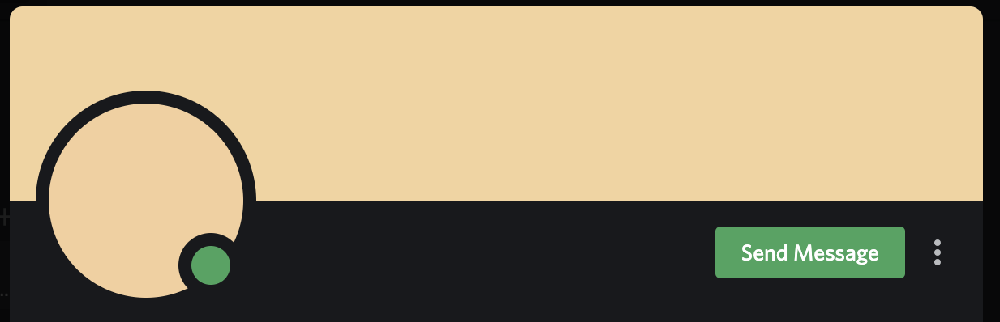

# beige-cycler
This cycles your discord profile picture between different shades of beige every hour.

## setup

`git clone https://github.com/ocapraro/beige-cycler`

`cd beige-cycler`

`npm install`

`nano .env`

paste this into your .env file, and add in the relevant information:
```
EMAIL=YourEmail
PASSWORD=YourPassword
TOKEN=YourReCaptchaToken
PORT=3000
```

## running

`node index.js`